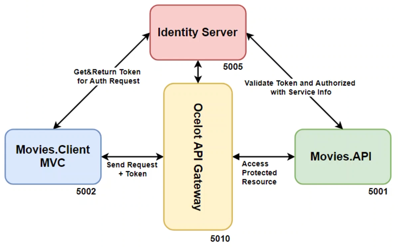

# .NET Microservices security architecture
A proof of concept security architecture for a fictional movie provider system, using microservices architecture and IdentityServer4 server, OAuth2 and OpenID protocols 🔑

# Architecture:

    

# Details
The goal of the project is to demonstrate a possible solution for securing a ASP.NET based microservices application with IdentityServer4 using OAuth2 and OpenID protocols. The backend of the project consists of a movies API, a Ocelot gateway and the IdentityServer. There is an example movies MVC client for the frontend as well.

# Skills and Technical Competences 
* Building IdentityServer4 Authentication Microservice
* Get Token from Identity Server with client_credentials grant_type
* Protecting API with Using IdentityServer4 OAuth 2.0 and JWT Token
* OpenID Connect with IdentityServer4 For Interactive MVC Client Micorservice
* IdentityServer4 OpenID Connect Integration For Client MVC Interactive Client Application
* Consume Protected API with HttpClientFactory From Client Application
* Hybrid Flow of IdentityServer4 Secure Interactive Mvc Client (OpenID) and Api Resources (OAuth2)
* Claim Based Authorization in IdentityServer4 Secure Interactive MVC Client (OpenID) and API Resources (OAuth2)
* Ocelot API Gateway Implementation for MVC Client to Interact w/ IdentityServer4 and Carry Token
* Claim Based Authentication with client_id Claim Restriction

# References
> The complete course can be found here [page](https://www.udemy.com/course/secure-net-microservices-with-identityserver4-oauth2openid/). 
